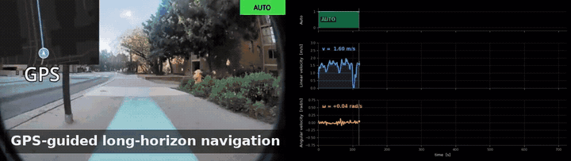
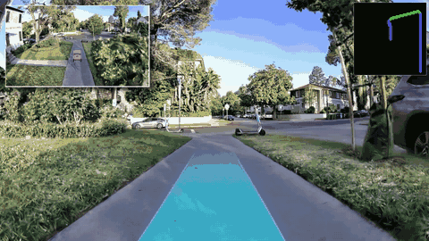
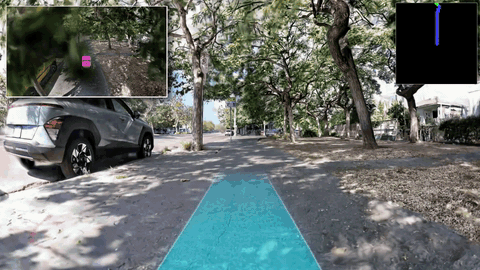

# FlowPilot

**From Imitation to Alignment: Human-Preference Flow Policies for Long-Horizon Sidewalk Navigation**

Conference on Robot Learning (CoRL) 2026

[](https://arxiv.org/abs/2606.12603)
[](https://www.corl.org/)
[](https://github.com/DhlinV/visnavkit)

<p align="center">
  
</p>
<p align="center"><sub>GPS-guided long-horizon navigation · sidewalk lane keeping · obstacle avoidance · pedestrian awareness · night driving</sub></p>

<p align="center">
  
  
</p>
<p align="center"><sub>Closed-loop rollouts in SidewalkBench-GS · Gaussian-splat reconstructions of real sidewalks</sub></p>

## Training recipe

The FlowPilot architecture ships as the `model=flowpilot` recipe in **[VisNavKit](https://github.com/DhlinV/visnavkit)**: a FastViT-MA36 encoder, a 4-layer scene transformer, 64 k-means anchors and an anchored rectified-flow decoder with Beta(1.5, 1) time sampling. The components are swappable Hydra groups, and the kit includes ONNX export and an open-loop benchmark.

```bash
uv run visnavkit-train dataset=torch model=flowpilot
```

## Release

Code, checkpoints and the human-preference alignment stage will be released here.
