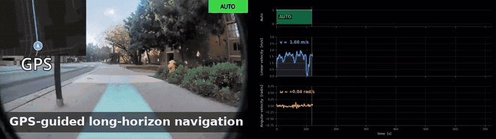
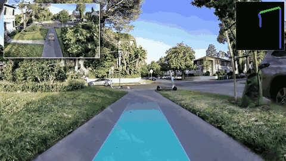
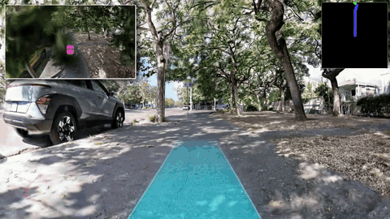

# FlowPilot

**From Imitation to Alignment: Human-Preference Flow Policies for Long-Horizon Sidewalk Navigation**

Conference on Robot Learning (CoRL) 2026

[](https://arxiv.org/abs/2606.12603)
[](https://www.corl.org/)
[](https://github.com/VAIL-UCLA/visnavkit)

<p align="center">
  
</p>
<p align="center"><sub>GPS-guided long-horizon navigation · sidewalk lane keeping · obstacle avoidance · pedestrian awareness · night driving</sub></p>

<p align="center">
  
  
</p>
<p align="center"><sub>Closed-loop rollouts in SidewalkBench-GS · Gaussian-splat reconstructions of real sidewalks</sub></p>

## Setup

The model code lives in **[VisNavKit](https://github.com/VAIL-UCLA/visnavkit)**, included here as a submodule on its `dev` branch.

```bash
git clone --recurse-submodules https://github.com/VAIL-UCLA/FlowPilot.git
cd FlowPilot/visnavkit
uv sync --extra export
```

In an existing clone, run `git submodule update --init` instead.

## Checkpoints

Weights are hosted in the [VAIL model zoo](https://huggingface.co/UCLA-VAIL/Visual-Navigation-Model-Checkpoints) on Hugging Face.

| Weights | Experiment | Model | Params | Checkpoint | ONNX |
| --- | --- | --- | --- | --- | --- |
| `flowpilot-dst-small` | `flowpilot_dst_clips1k` | FastViT-T12 frame pairs, anchored flow DiT | 21.4M | [ckpt](https://huggingface.co/UCLA-VAIL/Visual-Navigation-Model-Checkpoints/resolve/main/flowpilot-dst-small/flowpilot_dst_fastvit_t12.ckpt) | [onnx](https://huggingface.co/UCLA-VAIL/Visual-Navigation-Model-Checkpoints/resolve/main/flowpilot-dst-small/flowpilot_dst_fastvit_t12.onnx) |
| `flowpilot-dst-dune` | `flowpilot_dune_dst_clips1k` | frozen DUNE ViT-B/14, anchored flow DiT | 208.2M | [ckpt](https://huggingface.co/UCLA-VAIL/Visual-Navigation-Model-Checkpoints/resolve/main/flowpilot-dst-dune/flowpilot_dst_dune_vitb14.ckpt) | [onnx](https://huggingface.co/UCLA-VAIL/Visual-Navigation-Model-Checkpoints/resolve/main/flowpilot-dst-dune/flowpilot_dst_dune_vitb14.onnx) |

Inputs, outputs and a minimal ONNX Runtime example are in the [ONNX guide](https://github.com/VAIL-UCLA/visnavkit/blob/dev/docs/flowpilot_dst_onnx.md).

## Inference

`flowpilot` wraps the ONNX exports in the interface of the [Navigation Model Zoo](https://huggingface.co/UCLA-VAIL/Navigation-Model-Zoo-Public): frames and a goal in, a plan and a `(v, w)` command out.

```bash
pip install -e .                 # from the FlowPilot root
pip install onnxruntime-gpu      # optional, replaces onnxruntime for CUDA
```

```python
import numpy as np
from flowpilot import FlowPilotNavigator, GpsGoal, Route, RouteGoal, compass_to_yaw

nav = FlowPilotNavigator(variant="flowpilot-dst-small", device="cuda")   # downloads the graph

obs = np.random.rand(1, nav.context_size, 3, 216, 384).astype(np.float32)   # (B, T, 3, H, W) in [0, 1]
ego_vw = [1.2, 0.0]     # measured speed (m/s) and yaw rate (rad/s)

# Point goal: metres in the ego frame, x forward, y left
vw, plan = nav.inference_vw(obs, [8.0, 0.5], ego_vw)                    # pure pursuit, vw: (B, 2)
vw, plan = nav.inference_vw(obs, [8.0, 0.5], ego_vw, controller="pd")   # PD
traj, scores = nav.inference_trajectory(obs, [8.0, 0.5], ego_vw)        # (B, 6, 80, 5), (B, 6)

# GPS goal: a waypoint and the robot's fix, converted to a point goal
goal = GpsGoal(goal=(34.06901, -118.44512), robot=(34.06893, -118.44520), yaw=compass_to_yaw(45.0))
vw, plan = nav.inference_vw(obs, goal, ego_vw)

# Route goal: the route patch around the robot, plus the route point 12 m ahead as the point goal
route = Route([[0.0, 0.0], [25.0, 0.0], [25.0, 40.0]], crosswalks=None)   # world metres; Route.from_gps for lat / lon
vw, plan = nav.inference_vw(obs, RouteGoal(route, pose=(3.0, 0.2, 0.0)), ego_vw)

vw, plan = nav.step(obs[0, -1], [8.0, 0.5], ego_vw)   # streaming: one frame per call at 20 Hz
nav.reset()                                           # between episodes
```

- **Observations** are 20 frames at 20 Hz, oldest first, at any size. Shorter histories are padded with their oldest frame.
- **Plans** hold `[x, y, yaw, v, w]` every 0.05 s up to 4 s, with modes ranked best first.
- **Goals** are required, as the exports have no goal-free input. World poses are `(x, y, yaw)` with x east, y north and yaw counter-clockwise from east.
- **Ego status** should be measured odometry. Without it the previous command stands in, and a window of zeros reads as a robot at rest. A route goal with a pose per frame derives it from the poses.
- **Controllers** also run on their own: `make_controller("pure_pursuit").step(plan, ego_speed=1.2)` takes any `[x, y]` or `[x, y, yaw, v, w]` path. Limits, lookahead and gains are config fields, for example `max_v`, `max_steering_angle=None` for differential drive, `kp` and `kd`.

## Train and export

Run these from the `visnavkit` directory.

```bash
uv run visnavkit-train dataset=torch model=flowpilot                  # FlowPilot: FastViT-MA36, 64 anchors
uv run visnavkit-train experiment=flowpilot_dst_clips1k               # flowpilot-dst-small
uv run visnavkit-train experiment=flowpilot_dune_dst_clips1k \
  model.frame_encoder.weights=<DUNE ViT-B/14 ckpt>                    # flowpilot-dst-dune
uv run visnavkit-export-dst checkpoint=<ckpt> output=flowpilot_dst.onnx
```

## Release

The human-preference alignment stage will be released here.
